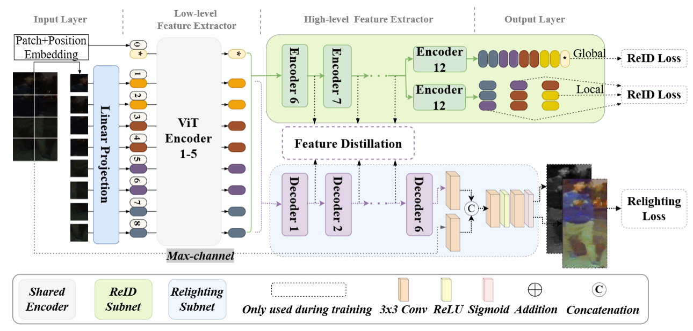
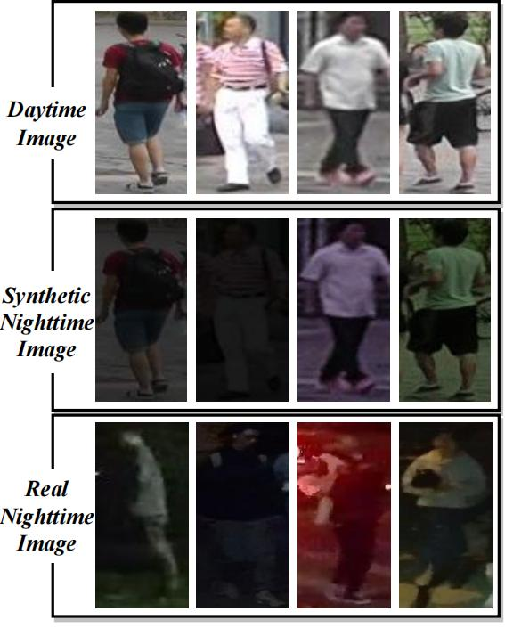

# Nighttime Person Re-Identification via Collaborative Enhancement Network with Multi-domain Learning
Prevalent nighttime person re-identification (ReID) methods typically combine image relighting and ReID networks in a sequential manner. However, their performance (recognition accuracy) is limited by the quality of relighting images and insufficient collaboration between image relighting and ReID tasks. To handle these problems, we propose a novel Collaborative Enhancement Network called CENet, which performs the multilevel feature interactions in a parallel framework, for nighttime person ReID. In particular, the designed parallel structure of CENet can not only avoid the impact of the quality of relighting images on ReID performance, but also allow us to mine the collaborative relations between image relighting and person ReID tasks. To this end, we integrate the multilevel feature interactions in CENet, where we first share the Transformer encoder to build the low-level feature interaction, and then perform the feature distillation that transfers the high-level features from image relighting to ReID, thereby alleviating the severe image degradation issue caused by the nighttime scenario while avoiding the impact of relighting images. In addition, the sizes of existing real-world nighttime person ReID datasets are limited, and large-scale synthetic ones exhibit substantial domain gaps with real-world data. To leverage both small-scale real-world and large-scale synthetic training data, we develop a multi-domain learning algorithm, which alternately utilizes both kinds of data to reduce the inter-domain difference in training procedure. Extensive experiments on two real nighttime datasets, Night600 and RGBNT201, and a synthetic nighttime ReID dataset are conducted to validate the effectiveness of CENet. 


## News :sparkles: Code is released
### Collaborative Enhancement Network


Checkpoints [Link](https://drive.google.com/file/d/1bbSuIwEzXkB09mqz0tg5XpIF_QC4cm7-/view?usp=drive_link)

### Synthetic nighttime ReID dataset comming soon


### Citation

Please kindly cite this paper in your publications if it helps your research:
```
@article{Lu2024CENet,
  author={Lu, Andong and Li, Chenglong and Zha, Tianrui and Wang, Xiaofeng and Tang, Jin and Luo, Bin},
  journal={IEEE Transactions on Information Forensics and Security}, 
  title={Nighttime Person Re-Identification via Collaborative Enhancement Network with Multi-domain Learning}, 
  year={2025},
  doi={10.1109/TIFS.2025.3527335}}
```
Contact: adlu_ah@foxmail.com

## Acknowledgment
This repo is based on [TranReID](https://github.com/damo-cv/TransReID.git), helps us to quickly implement our ideas.
